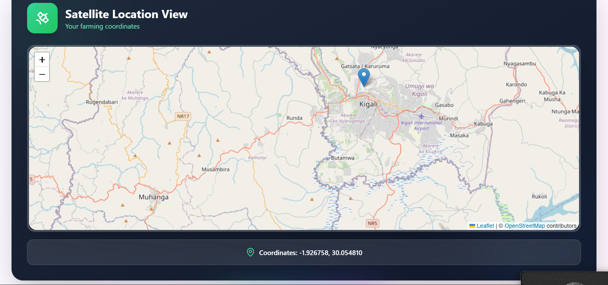
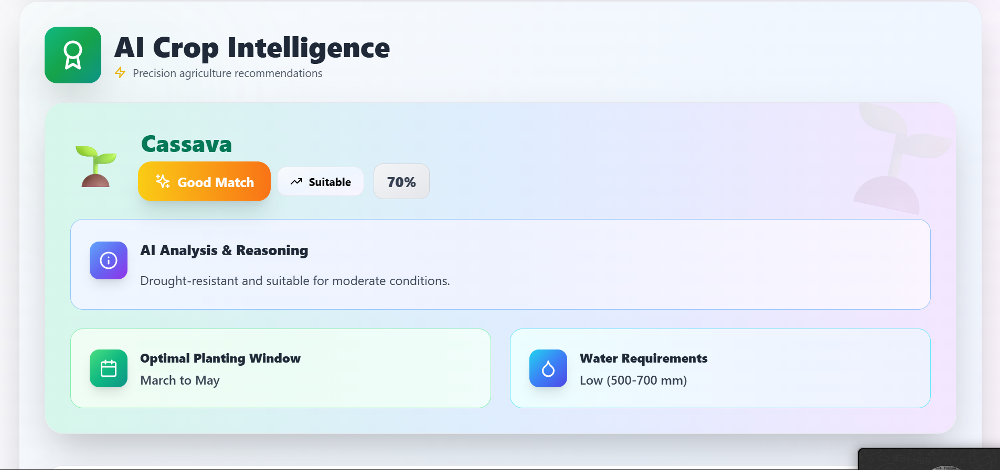

# 🌱 Climate-Resilient Farming Advisor

An AI-powered web application that helps farmers make data-driven decisions by providing personalized crop recommendations based on real-time weather, climate, and location data.

## 🚀 Features

- 📍 **Geolocation**: Automatically detects user location with high accuracy.
- 🌦️ **Weather Analysis**: Fetches current weather data using OpenWeatherMap.
- 🤖 **AI Crop Recommendation**: Suggests the best crops to grow in the current conditions.
- 🗺️ **Interactive Map**: Displays user location visually.
- 🔄 **Refresh Intelligence**: Allows users to re-analyze data with a single click.
- ⚠️ **Error Handling**: Gracefully handles network/location/weather errors.
- 💻 **Beautiful UI**: Fully responsive interface with animated visuals and transitions.

---

## 🌄 Screenshots

### 🏠 Homepage


### 🌱 Crop Recommendations


### 🗺️ Map View



## 🧑‍🌾 Use Case

This tool is ideal for:
- Farmers optimizing planting seasons
- Agricultural advisors
- Climate researchers and NGOs
- Government & local agricultural initiatives

---

## 🛠️ Tech Stack

### Frontend
- React (TypeScript)
- Tailwind CSS
- Custom Hooks for Geolocation & Data Fetching
- Map integration (e.g., Leaflet or Google Maps)

### Backend
- Python FastAPI
- AI/ML crop recommendation logic
- Integration with OpenWeatherMap API

---

## 📦 Setup Instructions

### Prerequisites
- Node.js (v16+)
- Python 3.8+
- OpenWeatherMap API Key

---

### 1. Clone the Repository

```bash
git clone https://github.com/moussassoss/climate-farming-advisor.git
cd climate-farming-advisor
```
### 2. Frontend setup

``` bash
npm install
npm start
```


## 🌐 API Endpoint

GET /recommend
Query Params:
- lat: Latitude (required)
- lon: Longitude (required)

## 🌍 Map & Location Notes
- Uses navigator.geolocation with enableHighAccuracy: true
- If running locally, ensure you test via HTTPS or mobile for accurate GPS

## ✅ TODO / Future Enhancements
- 📱 Mobile App (React Native)

- 🧠 Train custom ML model with local farming data

- 🌾 Support for soil quality and irrigation integration

- 📈 Dashboard for analytics over time

- 🔒 User accounts & saved fields

## 📸 Screenshots
Coming soon…

📄 License
MIT License © 2025 Moussa Mahamat Nassour

🙋‍♂️ Contact
For feedback, bugs, or contributions:

GitHub Issues

Email: moussamahamat621@gmail.com
